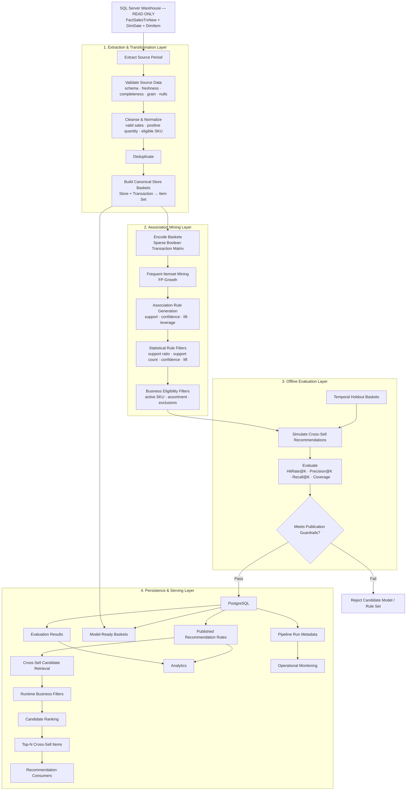
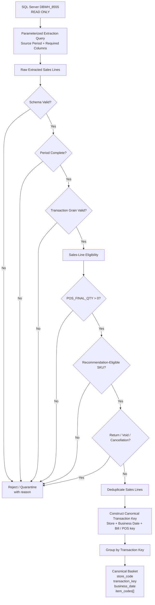
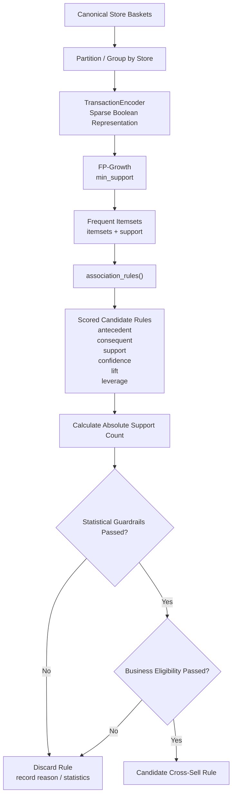
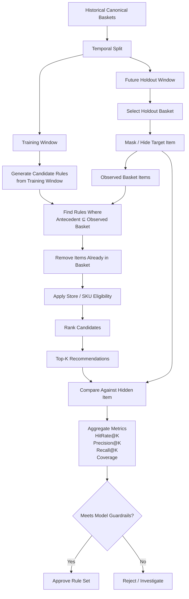
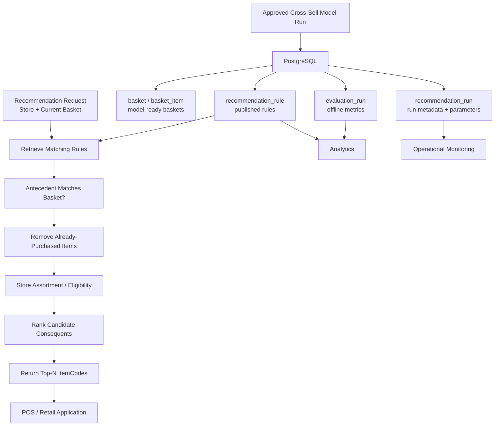
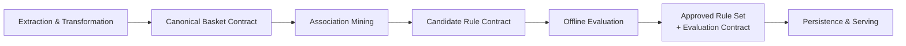

# System Architecture

## Purpose

The system produces store-level / basket-level cross-sell engine from retail transactions. It currently contains exploratory and batch Python implementations; the target production design separates extraction from the SQL Server warehouse, transformation and association mining, offline evaluation, and persistence and serving using PostgreSQL.

## Technology stack

The production stack favors a small, reproducible Python data application with explicit boundaries between warehouse extraction, basket transformation, association mining, evaluation, persistence, and orchestration. SQL Server remains read-only; PostgreSQL owns application state and published recommendation data.

| Area                                  | Current / target technology  |
| ------------------------------------- | -------------------------------------------------------------------- |
| Runtime                               | **Python 3.14.6**, pinned through `.python-version` and constrained by `pyproject.toml`|
| Dependency and environment management | **uv** with `pyproject.toml` and committed `uv.lock` for reproducible dependency resolution and environment synchronization |
| Data processing                       | **pandas** and **NumPy** for extraction results, validation, transformation, basket preparation, rule processing, and offline evaluation |
| Basket encoding                       | `mlxtend.preprocessing.TransactionEncoder` with sparse Boolean representations where appropriate |
| Association mining                    | **`mlxtend.frequent_patterns.fpgrowth`** for frequent-itemset mining and **`mlxtend.frequent_patterns.association_rules`** for rule generation and scoring; Apriori remains useful as an exploratory/baseline algorithm, while `fpgrowth_py` is to be retired from the production path |
| Rule quality                          | Python/pandas rule filtering using support ratio, absolute support count, confidence, lift, leverage, and explicit business-eligibility rules |
| Offline evaluation                    | Python with pandas/NumPy using temporal holdout evaluation; initial metrics include HitRate@K, Precision@K, Recall@K, catalog coverage, and store coverage |
| Source warehouse                      | **Microsoft SQL Server**, accessed read-only through **SQLAlchemy 2.x**, `pyodbc`, and Microsoft ODBC Driver for SQL Server; extraction queries are parameterized and source credentials are least-privilege   |
| Application database                  | **PostgreSQL** for model-ready baskets, published association rules, offline-evaluation results, pipeline-run metadata, and operational state |
| PostgreSQL access                     | **SQLAlchemy 2.x** with **psycopg 3** as the PostgreSQL DBAPI driver |
| Database migrations                   | **Alembic** for versioned and reversible PostgreSQL schema migrations |
| Configuration                         | Environment-backed application configuration with one documented `SOURCE_MSSQL_*`, `TARGET_POSTGRES_*`, and mining/evaluation parameter contract; secrets remain outside version control  |
| Scheduling                            | **External batch orchestration**; the application exposes deterministic, finite batch commands rather than embedding long-running scheduling loops |
| Observability                         | Structured application logging plus PostgreSQL pipeline-run metadata capturing execution status, source period, parameters, row/basket/rule counts, timings, code version, validation results, and failure reasons |
| Exploration                           | **Jupyter notebooks** for experiments and analysis; notebooks use repository-relative paths and synthetic or explicitly approved reference datasets rather than committed raw production transactions |
| Testing                               | **pytest** and **pytest-cov** for unit, regression, data-quality, and integration tests; ordinary unit tests remain independent of SQL Server, PostgreSQL, Spark, Java, and live ODBC connectivity |
| Static analysis                       | **Ruff** for Python linting and, when adopted across the application package, formatting and enforceable code-quality rules |
| Integration testing                   | GitHub Actions with disposable PostgreSQL for migration and persistence tests; SQL Server behavior is tested primarily through interfaces, fixtures, and contract tests rather than CI access to the production warehouse |
| Development harness                   | **uv**, pytest, pytest-cov, Ruff, repository/notebook validators, `AGENTS.md` guidance, deterministic fixtures, and **GitHub Actions** |
| Scale-out processing                  | **PySpark is optional and deferred**; introduce it only if representative benchmarks show the pandas/FP-Growth batch path cannot meet required runtime or memory targets |


## Business flow

1. Sales transactions are recorded in the enterprise warehouse.
2. The pipeline selects a completed reporting period and extracts store, bill, item, product, quantity, and sales attributes.
3. It removes excluded products and converts transactions into baskets by store and bill.
4. FP-Growth or Apriori identifies frequent itemsets; association rules are calculated and scored with support, confidence, lift, and related metrics.
5. Approved results are stored in PostgreSQL for downstream recommendation experiences and reporting.
6. A run is observable, validated, and promoted only after data-quality and model/business checks pass.

## Data flow

This is the future architecture for the store-level / basket-level cross-sell engine. It is designed to be modular, testable, and observable. The SQL Server warehouse is read-only; all application writes are to PostgreSQL.



### Extraction/Transformation Layer

This layer converts warehouse sales rows into the canonical input contract for the model.



**Responsibility**
This layer should answer:

> What exactly constitutes one valid Pepito retail basket?

That definition should be settled here—not inside FP-Growth.

### Association Mining Layer

This layer receives already-valid baskets. It should contain no SQL Server logic and ideally no persistence logic.



`mlxtend.fpgrowth()` supports Boolean/0–1 encoded transaction DataFrames and sparse DataFrames, and returns `support` plus `itemsets`, which makes it a clean fit for this boundary.

**Important separation**

Keep:
```
statistical filtering
```

separate from:

```
business filtering
```

For example:

**Statistical:**

```
support >= 0.001
support_count >= N
confidence >= X
lift >= Y
```

**Business:**

```
consequent is active
consequent is sellable
consequent is recommendation eligible
valid for store assortment
not a service SKU
not a shopping bag
```

That separation will make later tuning much cleaner.

### Offline Evaluation Layer

This layer answers a different question from association-rule mining:

> Do the rules actually work as cross-sell recommendations on unseen future baskets?



This separation is important because rule metrics and recommendation metrics are not interchangeable. `association_rules()` measures rule characteristics such as support, confidence, lift, leverage and conviction.

Offline evaluation then assesses the behavior of the whole recommendation procedure against future baskets.


### Persistence & Serving Layer

This is where PostgreSQL becomes an application database, rather than another warehouse.



It would keep the designed normalized basket + basket_item rather than copying all warehouse sales-line fields into PostgreSQL. PostgreSQL can support structured alternatives such as arrays or jsonb, but normalization remains a clearer primary contract for this relational workflow; PostgreSQL's documentation confirms native jsonb support and associated indexing/query facilities if you later need a derived structured representation.

### Relationships between layers

The most useful architectural rule is that every layer has a **defined input and output contract**:



## Current repository components

- `apriori_store.py`: per-store FP-Growth batch implementation and existing SQL Server persistence code that must be migrated to PostgreSQL.
- `apriori.py`: earlier all-store Apriori implementation.
- `notebooks/`: exploratory analysis and algorithm experiments.
- `datasets/`: local reference or exploratory datasets; production data must not be added without an approved data-governance exception.
- `executable/`: batch launchers.
- `logs/`: local runtime logs, excluded from version control.

## Development harness flow

```text
Issue branch and local change
           |
           v
uv locked environment -> repository checks -> notebook checks -> scoped Ruff -> pytest
           |
           v
GitHub Actions: blocking Windows harness + advisory Linux portability
           |
           v
Reviewed pull request to develop -> staging -> main
```

Harness tests use repository fixtures and notebook JSON only. They do not connect to SQL Server or PostgreSQL and do not execute Spark.

## Architectural rules

- SQL Server is a source only; PostgreSQL owns all application writes.
- Data access, transformation, mining, and persistence must have explicit interfaces and independently testable behavior.
- Run metadata must identify source period, code version, parameters, row counts, outputs, status, and error reason.
- Schema changes are versioned, reviewed, and reversible.
